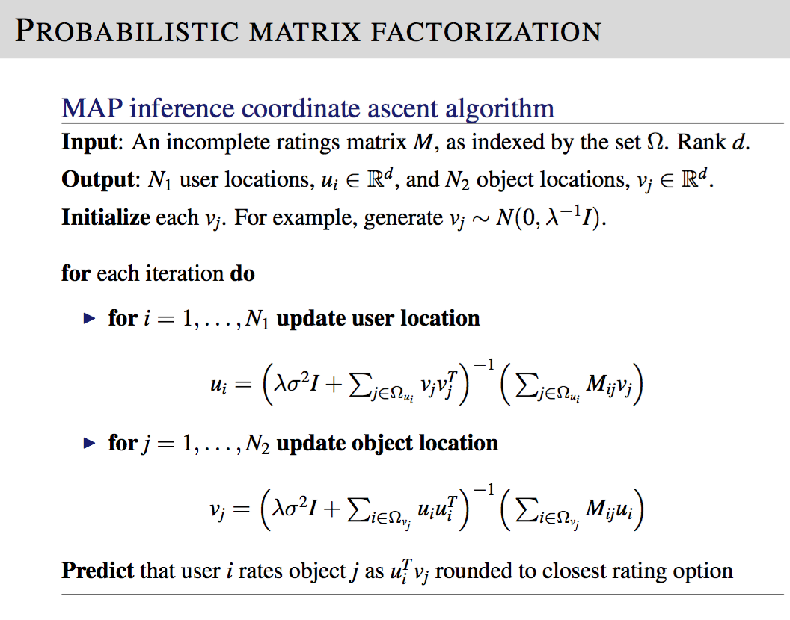
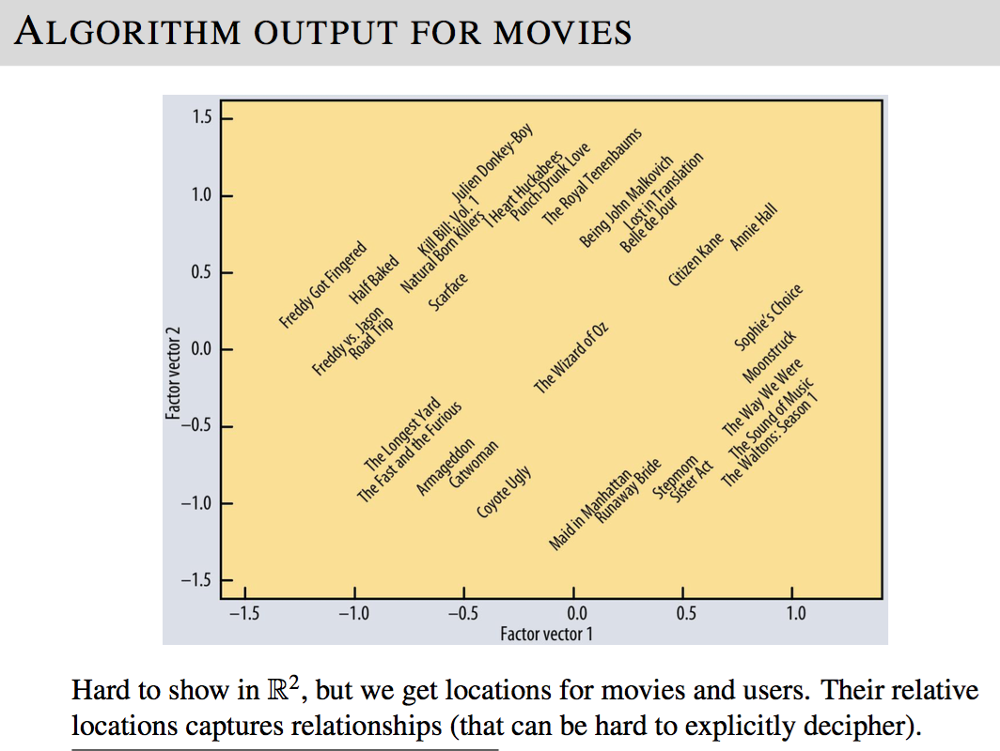

# Movie Recommender via Collaborative Filtering

Implementation of the MAP inference algorithm for matrix completion for movie recommendations from scratch.

## Data
This data set consists of:
* 100,000 ratings (1-5) from 943 users on 1682 movies. 
* Each user has rated at least 20 movies. 
* Simple demographic info for the users (age, gender, occupation, zip)

The following files are included in the data folder:

1. ratings.csv contains the ratings data in the format: user_id, movie_id, rating

2. ratings_test.csv contains the test set with ground truth in the same format as ratings.txt.

3. movies.txt contains the mapping from movie_id to movie name. Row j corresponds to index j of movie_id.

4. README (original) is the original readme for the MovieLens 100K data set

I have subtracted the mean from the ratings. No other pre-processing is necessary.

## Technology Used
- Python 3

## Algorithm

## Results
