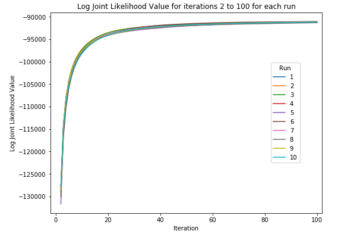
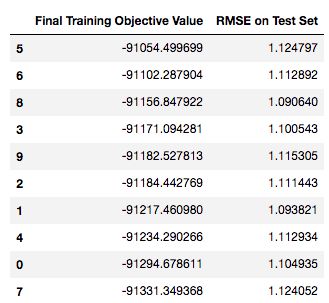
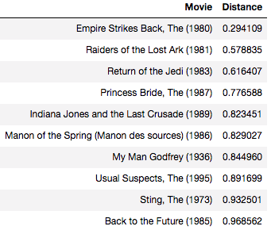
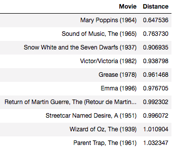

# Movie Recommender via Collaborative Filtering

Implementation of the MAP inference algorithm for matrix completion for movie recommendations from scratch.

## Data
This data set consists of:
* 100,000 ratings (1-5) from 943 users on 1682 movies. 
* Each user has rated at least 20 movies. 
* Simple demographic info for the users (age, gender, occupation, zip)

The following files are included in the data folder:

1. ratings.csv contains the ratings data in the format: user_id, movie_id, rating

2. ratings_test.csv contains the test set with ground truth in the same format as ratings.txt.

3. movies.txt contains the mapping from movie_id to movie name. Row j corresponds to index j of movie_id.

4. README (original) is the original readme for the MovieLens 100K data set

I have subtracted the mean from the ratings. No other pre-processing is necessary.

## Technology Used
- Python 3

## Algorithm

## Results
Single plot of joint likelihood for iterations 2 to 100 for each run.

Table of final value of training objective function and RMSE on the testing set sorted by decreasing value of the objective function.

10 closest movies to ”Star Wars” according to Euclidean distance.

10 closest movies to ”My Fair Lady” according to Euclidean distance.

10 closest movies to ”Goodfellas” according to Euclidean distance.

